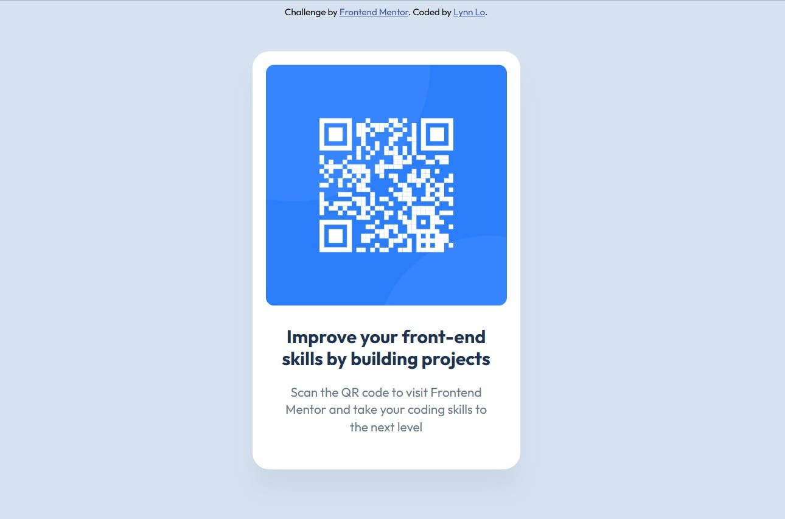

# Frontend Mentor - QR code component solution

This is a solution to the [QR code component challenge on Frontend Mentor](https://www.frontendmentor.io/challenges/qr-code-component-iux_sIO_H). Frontend Mentor challenges help you improve your coding skills by building realistic projects. 

## Overview

### Screenshot

### Links

- [Solution URL](https://github.com/LynnLo30/QR-code-component)
- [Live Site URL](https://lynnlo30.github.io/QR-code-component/)

## My process

### Built with

- Semantic HTML5 markup
- CSS custom properties
- SCSS features like variables and nesting
- Flexbox
- Mobile-first workflow
- [SCSS Reset](https://meyerweb.com/eric/tools/css/reset/) - Based on Meyer's CSS Reset

### What I learned

Use `max-` & `min-` to control width and height for best responsive, instead of set a fixed sizing.